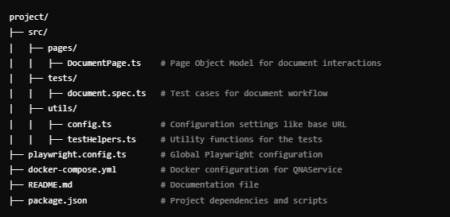

# Document Automation with Playwright

This project automates the workflow of uploading, processing, querying, and validating documents using [Playwright](https://playwright.dev/). It utilizes a **Page Object Model (POM)** structure for maintainable and reusable code.

---

## **Table of Contents**
- [Overview](#overview)
- [QNAService](#qnaservice)
- [Prerequisites](#prerequisites)
- [Installation](#installation)
- [Running Tests](#running-tests)
- [Project Structure](#project-structure)

---

## **Overview**
The project automates the following workflow:
1. Select a single document by clicking on the `Choose file`
2. Click on the Upload icon
3. Once the document is uploaded, it needs to be processed. 
4. Click on the play icon to process the document
5. Once the document is processed, you can enter your query in the text box and click on the `Ask Question` button to get the answer.
6. The answer will be displayed in the `Answer` section. and to see references expand each reference to see the source of the answer.
7. To modify the document, delete the document by clicking on the delete icon and upload a new document.

---

## How to run the project

1. Open 'docker-compose.yml' file and set the following environment variables if the added one is not working. 
yaml
    environment:
      - OPENAI_API_KEY=<YOUR_OPENAI_API_KEY>


2. In the root directory of the project, run the following command:
bash
docker-compose up

3. Access the Web UI
```
http://localhost:8000
```
4. If you can't access to localhost:8000, open docker and run the  `qnaservice-app-1` from docker.

---

## **Prerequisites**
Make sure the following tools are installed on your system:
1. [Node.js](https://nodejs.org/) (version 14 or above)
2. [Playwright](https://playwright.dev/)
3. Docker for the QNAService
4. A code editor like [VSCode](https://code.visualstudio.com/)

---

## **Installation**

1. Install dependencies:
   ```npm install```

2. Install dependencies:
   ```npx playwright install```

## **Running Tests**
 
1. Run All Tests:
   ```npx playwright test``` 

2. Run a Specific Test:
   ```npx playwright test <test-file-name>.spec.ts```   

3. Generate HTML Report:    
    ```npx playwright test --reporter=html``` 
    ```npx playwright show-report``` 

## **Running Tests**




